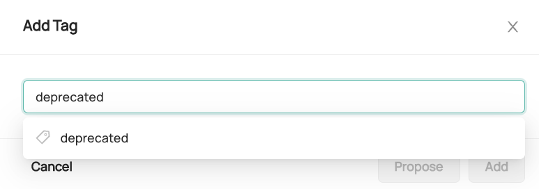
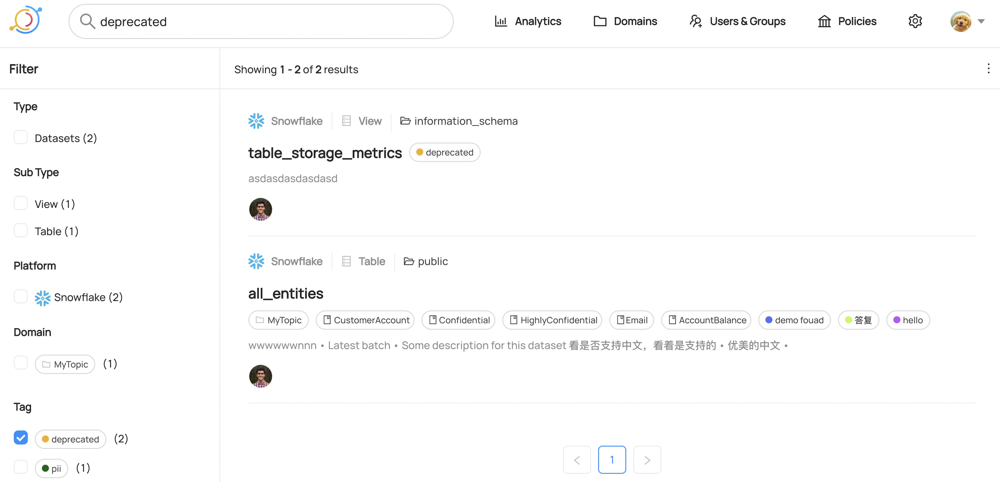

# Tags Guide

## What is a Tag? 

Tags are metadata that can be added datasets, dataset schemas, or containers. They provide an easy way to label or categorize entities. 

### Tags vs. Glossary Terms vs. Domains

DataHub supports Tags, Glossary Terms, & Domains as distinct types of Metadata that are suited for specific purposes:

- **Tags**: Informal, loosely controlled labels that serve as a tool for search & discovery. Assets may have multiple tags. No formal, central management.
- **Glossary Terms**: A controlled vocabulary, with optional hierarchy. Terms are typically used to standardize types of leaf-level attributes (i.e. schema fields) for governance. E.g. (EMAIL_PLAINTEXT)
- **Domains**: A set of top-level categories. Usually aligned to business units / disciplines to which the assets are most relevant. Central or distributed management. Single Domain assignment per data asset.

## Adding a Tag

Users must have the Metadata Privilege called `Edit Tags` to add tags at the entity level, and the Privilege called `Edit Dataset Column Tags` to edit tags at the column level. These Privileges
can be granted by creating a new Metadata [Policy](authorization/policies.md).

To add a tag at the dataset or container level, simply navigate to the page for that entity and click on the "Add Tag" button. 

You can then type in the name of the tag you would like to add. You can either add a tag that already exists, or add a new tag entirely. The autocomplete will pull up the tag if it already exists.

Click on the "Add" button and you'll see the tag has been added!

If you would like to add a tag at the schema level, hover over the "Tags" column for a schema until the "Add Tag" button shows up, and then follow the same flow as above.

## Removing a Tag

To remove a tag, simply click on the "X" button in the tag. Then click "Yes" when prompted to confirm tag removal.

## Searching by Tag

You can search for a tag in the search bar, and if you wish, even filter entities by the presence of a specific tag.

## Feedback / Questions / Concerns

We want to hear from you! For any inquiries, including Feedback, Questions, or Concerns, reach out on Slack!